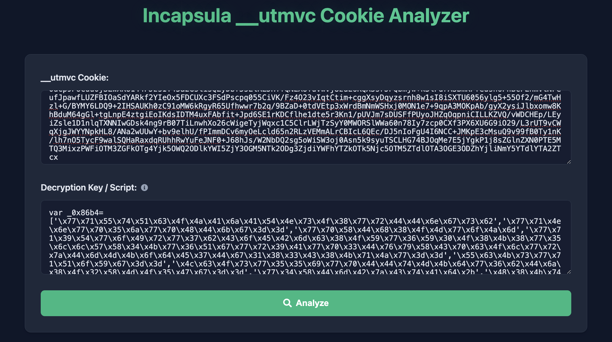

# Incapsula ___utmvc Cookie Analyzer & Decryptor

A web-based tool to analyze and decrypt Incapsula's ___utmvc cookies. Try it out [here](https://incapsula-utmvc-cookie-decryptor.vercel.app).



[Vercel](https://incapsula-utmvc-cookie-decryptor.vercel.app) | [Example cookie decryption](https://incapsula-utmvc-cookie-decryptor.vercel.app/?__utmvc=0lvoe18Q0csdUWZWa8yfvaz3Bb0ZRN15a%2Fctvna89U8S0KSVvCnwRqP1EnJvOCNc3xL3OKQKysgJ40d3n9HsGrlVPydm%2FE6gwsiGZ8wmpKy3RAV3TL%2BVU4B6NMiIq%2FaIcripWn3C0vsvzCsHz%2BXb9TTCe70rSXM10lw%2FmqFD7MJlAy7sI4p1YsZdTWjojDK5Luf%2FWKagenG%2BcyZtO2SfWVYCiKB8Z9By7FBOsLcOG37K%2BsOrUX8V9K0nVjnFqth4gzxeE%2B3sj0SxGgKGOo6RrelNjKZUKAyMCKB3SQtKsEGu9Hk25a%2F6NqUZMLQ5A5vVRsgfmTac1abjEvA3pRFtO%2BsnDK%2Bm3NvMMuWukZWMN6wBvE%2FUDvI%2Bh6NxDG8X5ZFy2gSWUvq6aFGNM%2BxapxM5uaJ8rlRKLMCEBFhZSMBS%2BxZLHPzNDdvzLsLH9zW7RVaexQooYplPYbXoy%2BhrIWMMPT2BKMYo2xd13aVoC6QqxKFvll94wMzqa5f5HRnN%2F1VFkHJ2FzSJHfUSwzL8TRPXhccCHBa19rARRmEMVsNvucbAVct%2FHIt8IqQiz3HnMRyKKIQMADlYbR32d%2BTSjGXth%2Bx6nxdonrWLTrDs0SLNuwSKyqMzhqnyRCVu%2Fz%2FKpLIYlYk%2FRwwcgKIn3bHfMBgiXUgosKJL6QKhv0Oue7NOBVYbiEVyNufEh7Q%2Fmvh9mjDbnOJ8JMVh7h8qJMXZptj3EGBpYJaYWotHvHK4lClEx1dPrkChlXMtxwAsFYG7cdHfxuwSY6E3J604hQYGkkqxqPHggZfL4GPrPphY56RgCUE37wMV722tXtv97I4x03W30ZDoPD2Pd8x%2B8WjwvnGyWNERFHRIQS0X8guVq8i0s%2FfGKN0P%2BZbxtwYE75JJeYN0C5X8e81vUsKnJK7ClwjGhPrkB9X7YC1nZ2ZVZ2Bh3cM%2BMJfKkmJdEwzARbldFxs%2F5DyUQb9WV70PkjET66QXRf9YyQxLRUuQheWKh4kTh07yeFFTFb1gkKIFA11EXrYvQXpYY5BTeWrschlSuvDd%2FzK5v1BgPzzktUjIp9%2BYKLupJccgapDNKc6mwujUNhPn1BLnbNn6EL9c5hLNFs2UKFaSh4X3sxtjKFjqjMp6fg5usx5yZvq1aQXl%2FEEZQGMo%2FUTtcJfGJuALr3z53EJC5jFJcDl26uTHVsCgAyGdZTWqM0r5aB4EsmNcRDqt2uHzFMpKTSG%2B3wrNQxg6Hv%2F9cJo%2BLJyM0bbdTc7cA9ZVNxTzu50K0%2FTa7J%2FhwzH%2F2ktDvlRlNxCXU7waaim4MIxcvVM%2FyNvxDTrqVtoGF4T71nMvNC16diFyfhAiZ8PKiUeGtBD%2BRMNTxzBRVQiXApdTH8Au5HQGbFyuxqqCkUi4iASKUx3ODBL%2FOVd6UqBInNmSnOMoh3ACfU3gU0Wi5QgtD4CHf3DodnkaqPnhimxJ7v7Z2jMJU3tT%2BWCEX4erzh16ceWkpxi4NH77lygBl4HPxeHLk3xDn8wPNlGYlb%2FQC3xfQuLHpeXAPc5%2BNzuW%2BPx0py4bsBQOGbhLk%2FYBi0NxQXdbc1pyuAlyCVdoVh%2FiJEUipoZztYEY0gweq04fZ5mCrpfS7baO0z97f1Cqy880UDQy9R9BGbrAtyGkK8a7YbeplZgrhgid3iU1fvcLuMIeqzlWAN3HTDoTlaB%2FQjLz3pBHQNfGIe3g9k9uu5nZeJvv%2Buk6IOVPSf%2F%2BHVKr6rK3B39b52M8zbBlsKFxbJcRhGVaw55%2FEdTCtb9CqTk1mWS%2Bq6wL8l%2FNv268EJnZi%2FzRU3ZnuuS3H2JLCjhzhBZohrww3Gpfr3hG5FO2wL%2FjIIHcY2adpVRht%2Bl3DW7ejjHAM1ObQRQaf8tXs7nbDgVPejEy1e3LlxqmerfTqBbW55XAhj8ml8UarCDLIsPrQUTJT6g3V6WU7ki%2F3qCeg%2FShbW694dBFkF9rS1DlnQ%2F6bYjq%2BoKKV6t%2FGEuWvaZCAE58%2F8q0w0IT2SNOrjP%2BKf9gRi3C7FxkZHxrA8ZMmfwMtZG8im%2FgtT0uCp9PoCuu0jSZwXKo144FJzsIY45a2GslisQZyDbf5sLlRLJHTfQNEXUTuVwvj8zuE6KQX3srJPQbmjw%2Bk3lFdrASBmKPfedsn6FhBcFEnmVtNFeufJpawfLUZFBIOaSdYARkf2YIeOx5FDCUXc3FSdPscpq055CiVK%2FFz4O23vIqtCtim%2BcggXsyDqyzsrnh8w1sI8iSXTU6056ylg5%2B55Of2%2FmG4TwHzl%2BG%2FBYMY6LDQ9%2B2IHSAUKh0zC91oMW6kRgyR65Ufhwwr7b2q%2F9BZaD%2B0tdVEtp3xWrdBmNmWSHxj0MON1e7%2B9qpA3MOKpAb%2FgyX2ysiJlbxomw8KhBduM64gGl%2BtgLnpE4ztgiEoIKdsIDTM4uxFAbfit%2BJpd6SE1rKDCflhe1dte5r3Kn1%2FpUVJm7sDUSFfPUyoJHZqOqpniCILLKZVQ%2FvWDCHEp%2FLEyiZsle1D1nlqTXNNIwGDsk4ng9rB07TiLnwhXo26cWigeTyjWqxc1C5ClrLWjTzSyY0MWORSlWWa60n78Iy7zcp0CXf3PX6XU6G9iO29%2FL3rUT9vCWqXjgJWYYNpkHL8%2FANa2wUUwY%2Bbv9elhU%2FfPImmDCv6myOeLcld65n2RLzVEMmALrCBIcL6QEc%2FDJ5nIoFgU4I6NCC%2BJMKpE3cMsuQ9v99fB0Ty1nK%2Flh7nO5TycF9walSQHaRaxdqRUhhRwYuFeJNF0%2BJ68hJs%2FW2NbDQ2sg5oWiSW3oj0Asn5k9syuTSCLHG74BJOqMe7E5jYgkP1j8sZGlnZXN0PTE5MTQ3MixzPWFiOTM3ZGFkOTg4Yjk5OWQ2ODlkYWI5ZjY3OGM5NTk2ODg3ZjdiYWFhYTZkOTk5Njc5OTM5ZTdlOTA3OGE3ODZhYjliNmY5YTdlYTA2ZTcx&decryptionKey=zZLya)

## Table of Contents
- [Incapsula \_\_\_utmvc Cookie Analyzer \& Decryptor](#incapsula-___utmvc-cookie-analyzer--decryptor)
  - [Table of Contents](#table-of-contents)
  - [Overview](#overview)
  - [Features](#features)
  - [How It Works](#how-it-works)
  - [Technical Details](#technical-details)
  - [Related Projects](#related-projects)
  - [Usage](#usage)
  - [Local Development](#local-development)
  - [Contributing](#contributing)
  - [Author](#author)

## Overview

The Incapsula ___utmvc cookie is part of an outdated protection mechanism from Incapsula. This protection relied on:
1. A dynamic endpoint serving obfuscated JavaScript
2. Browser fingerprinting and analysis
3. RC4 encryption with a dynamic key
4. Cookie-based authentication for protected endpoints

While this method is now outdated, it's still used by websites that haven't updated their security measures in years.

## Features

- 🔐 Decrypt ___utmvc cookies
- 🔍 Analyze browser fingerprinting data
- 🔑 Extract decryption keys from obfuscated scripts
- 📋 Copy results in formatted JSON
- 🔗 Shareable URLs for easy collaboration
- 🌐 Web-based interface, no installation needed

## How It Works

The protection flow works as follows:

1. Website serves an obfuscated JavaScript file
2. Script collects browser information
3. Data is combined with script-based hashes
4. RC4 encryption is applied using a dynamic key
5. Result is set as the `___utmvc` cookie
6. Cookie is used for subsequent request authentication

## Technical Details

The decryption process involves:

1. **Key Extraction**: Using the `file-analyzer` module (based on my old[Incapsula-utmvc-Deobfuscator](https://github.com/glizzykingdreko/Incapsula-utmvc-Deobfuscator)) to deobfuscate the script and extract the encryption key
2. **RC4 Decryption**: Reversing the RC4 encryption using the extracted key
3. **Data Parsing**: Analyzing the decrypted data to extract browser fingerprinting information

You can find the complete decryption process in the [`decryptor.js`](decryptor.js) file.

## Related Projects

- [Incapsula-utmvc-Deobfuscator](https://github.com/glizzykingdreko/Incapsula-utmvc-Deobfuscator) - Tool to deobfuscate Incapsula's dynamic __utmvc scripts
- [Medium Article](https://medium.com/@glizzykingdreko/breaking-down-the-incapsulas-utmvc-cookie-ea5668b765c5?sk=383ff18fdba4c93c8a53ef5e6bd28130) - Detailed explanation of the project development

## Usage

1. Visit the [online tool](https://incapsula-utmvc-cookie-decryptor.vercel.app)
2. Input your ___utmvc cookie
3. Either:
   - Paste the full Incapsula script
   - Or just the 5-character decryption key
4. Click "Analyze" to see the decrypted results

## Local Development

Clone the repository

```bash
git clone https://github.com/glizzykingdreko/incapsula-___utmvc-cookie-decryptor
```

Install dependencies

```bash
npm install
```

Start the development server

```bash
npm start
```

Open the browser and navigate to `http://localhost:3000` to use the tool.

## Contributing

Contributions are welcome! Feel free to:
- Report bugs
- Suggest features
- Submit pull requests

## Author

- [@glizzykingdreko](https://github.com/glizzykingdreko)
- [Medium](https://medium.com/@glizzykingdreko)
- [Twitter](https://twitter.com/glizzykingdreko)